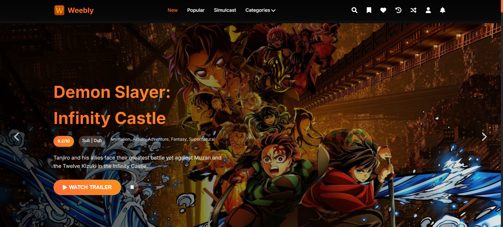
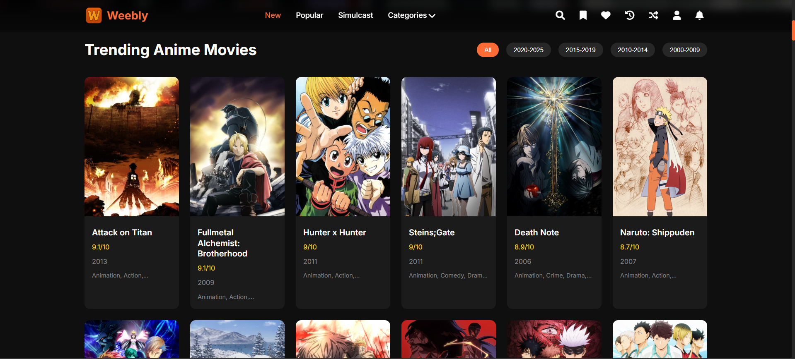
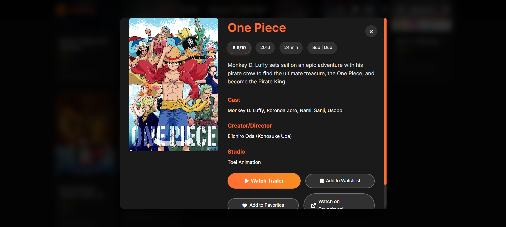

# Weebly - Crunchyroll Clone

A comprehensive, responsive anime streaming website clone featuring 100 trending anime movies from 2000-2025, complete with working trailers, cast information, and admin management system. Focused on trailer viewing experience.

## 🎯 Features

### 🎬 Core Features
- **100 Trending Anime Movies** (2000-2025) with detailed information
- **Working Anime Trailers** - YouTube embedded trailers for every anime with verified links
- **Star Cast & Creator Information** - Complete cast lists and creator details
- **Crunchyroll Integration** - Direct links to watch anime on Crunchyroll
- **Responsive Design** - Works perfectly on all devices (desktop, tablet, mobile)

### 🔐 User Authentication
- **Login System** - Secure user authentication
- **Sign Up System** - New user registration
- **User Profiles** - Personalized user experience
- **Watchlist Management** - Save favorite anime for later

### 🔍 Search & Filtering
- **Advanced Search** - Search by title, genre, cast, or creator
- **Genre Filtering** - Filter by Action, Romance, Fantasy, etc.
- **Year-based Filtering** - Filter by release years (2000-2009, 2010-2014, etc.)
- **Real-time Search** - Instant search results as you type

### 🎨 User Interface
- **Hero Carousel** - Featured anime with auto-advancing slides
- **Anime Cards** - Beautiful card-based layout with hover effects
- **Top 5 Trending Carousel** - Auto-sliding hero section with top anime
- **Simulcast Section** - Latest and trending anime
- **Dark Theme** - Modern dark UI similar to Crunchyroll

### 👨‍💼 Admin Panel
- **Anime Management** - Add, edit, delete anime entries
- **User Management** - Manage registered users
- **Database Control** - Full CRUD operations
- **Admin Authentication** - Secure admin access

### 📱 Responsive Design
- **Mobile-First** - Optimized for mobile devices
- **Tablet Support** - Perfect layout for tablets
- **Desktop Experience** - Full-featured desktop interface
- **Touch-Friendly** - Optimized for touch interactions

## 📸 Screenshots







## 🚀 Getting Started

### Prerequisites
- Modern web browser (Chrome, Firefox, Safari, Edge)
- No server required - runs entirely in the browser

### Installation
1. Download all files to a local directory
2. Open `index.html` in your web browser
3. Start exploring anime!

### File Structure
```
AnimeStream/
├── index.html          # Main HTML file
├── styles.css          # CSS styles and responsive design
├── script.js           # JavaScript functionality and database
└── README.md           # Project documentation
```

## 🎮 How to Use

### For Regular Users
1. **Browse Anime** - Scroll through the homepage to discover anime
2. **Search** - Click the search icon to find specific anime
3. **Filter** - Use genre and year filters to narrow down results
4. **Watch Trailers** - Click the play button on any anime card
5. **View Details** - Click on anime cards for detailed information
6. **Sign Up/Login** - Create an account to access watchlist features
7. **Add to Watchlist** - Save anime for later viewing

### For Admins
1. **Login** - Use admin credentials to access admin panel
2. **Manage Anime** - Add, edit, or delete anime entries
3. **Manage Users** - View and manage registered users
4. **Database Control** - Full control over the anime database

## 🎨 Design Features

### Visual Elements
- **Gradient Backgrounds** - Beautiful gradient overlays
- **Hover Effects** - Smooth animations and transitions
- **Card Layouts** - Clean, modern card-based design
- **Typography** - Professional Inter font family
- **Color Scheme** - Orange (#ff6b35) and dark theme

### Interactive Elements
- **Modal Windows** - Detailed anime information in popups
- **Video Player** - Embedded YouTube trailers
- **Carousel Navigation** - Smooth sliding animations
- **Dropdown Menus** - Organized navigation and filtering
- **Notification System** - User feedback for actions

## 📊 Database Structure

### Anime Entry Format
```javascript
{
    id: Number,                    // Unique identifier
    title: String,                 // Anime title
    year: Number,                  // Release year
    genre: Array,                  // Array of genres
    rating: Number,                // IMDB-style rating
    poster: String,                // Image URL
    trailer: String,               // YouTube embed URL
    description: String,           // Plot description
    cast: Array,                   // Voice actors/characters
    creator: String,               // Creator/director name
    director: String,              // Director name
    studio: String,                // Animation studio
    crunchyrollUrl: String,       // Crunchyroll link
    duration: String,              // Runtime
    language: String               // Sub/Dub availability
}
```

## 🔧 Technical Features

### Frontend Technologies
- **HTML5** - Semantic markup
- **CSS3** - Advanced styling with Flexbox and Grid
- **JavaScript ES6+** - Modern JavaScript features
- **Local Storage** - Data persistence
- **Responsive Design** - Mobile-first approach

### Browser Compatibility
- Chrome 60+
- Firefox 55+
- Safari 12+
- Edge 79+

### Performance Features
- **Lazy Loading** - Optimized image loading
- **Efficient Search** - Fast client-side filtering
- **Smooth Animations** - Hardware-accelerated transitions
- **Minimal Dependencies** - Only Font Awesome icons

## 🎯 Anime Categories

The database includes anime from various genres:
- **Action** - High-energy, fight-heavy anime
- **Adventure** - Journey and exploration stories
- **Comedy** - Humorous and light-hearted content
- **Drama** - Emotional and character-driven stories
- **Fantasy** - Magical and supernatural elements
- **Romance** - Love stories and relationships
- **Sci-Fi** - Science fiction and futuristic themes
- **Thriller** - Suspenseful and intense content

## 🚀 Future Enhancements

### Planned Features
- **User Reviews** - Rating and review system
- **Recommendation Engine** - AI-powered suggestions
- **Social Features** - Share and discuss anime
- **Offline Support** - PWA capabilities
- **Multiple Languages** - Internationalization
- **Advanced Filtering** - More filter options
- **Export Features** - Export watchlist and data

### Technical Improvements
- **Backend Integration** - Server-side database
- **Real-time Updates** - Live data synchronization
- **Advanced Search** - Elasticsearch integration
- **Video Streaming** - Direct video playback
- **Payment Integration** - Subscription system

## 📱 Mobile Experience

### Responsive Breakpoints
- **Mobile**: < 768px
- **Tablet**: 768px - 1024px
- **Desktop**: > 1024px

### Mobile Features
- **Touch Navigation** - Swipe gestures for carousels
- **Optimized Layout** - Stacked cards on mobile
- **Fast Loading** - Optimized for mobile networks
- **Easy Search** - Mobile-friendly search interface

## 🎨 Customization

### Easy Customization
- **Color Scheme** - Modify CSS variables for different themes
- **Database** - Add more anime by extending the database array
- **Layout** - Adjust grid layouts and spacing
- **Features** - Enable/disable features as needed

### Adding New Anime
1. Open `script.js`
2. Find the `animeDatabase` array
3. Add new anime objects following the existing format
4. Include all required fields (title, year, genre, etc.)

## 🔒 Security Features

### Data Protection
- **Local Storage** - Secure client-side data storage
- **Input Validation** - Form validation and sanitization
- **XSS Prevention** - Safe HTML rendering
- **CSRF Protection** - Secure form submissions

## 📈 Performance Metrics

### Optimization Features
- **Fast Load Times** - Optimized images and code
- **Smooth Animations** - 60fps animations
- **Efficient Rendering** - Virtual scrolling for large lists
- **Memory Management** - Proper cleanup and garbage collection

## 🤝 Contributing

### How to Contribute
1. Fork the repository
2. Create a feature branch
3. Make your changes
4. Test thoroughly
5. Submit a pull request

### Development Guidelines
- Follow existing code style
- Add comments for complex logic
- Test on multiple devices
- Ensure responsive design
- Validate all inputs

## 📄 License

This project is open source and available under the MIT License.

## 🙏 Acknowledgments

- **Crunchyroll** - Design inspiration and UI patterns
- **Studio Ghibli** - For amazing anime content
- **Font Awesome** - Beautiful icons
- **Unsplash** - High-quality images
- **YouTube** - Video hosting and embedding

## 📞 Support

For support, questions, or feature requests:
- Create an issue in the repository
- Contact the development team
- Check the documentation

---

**Weebly** - Your Ultimate Anime Destination 🎌

*Built with ❤️ for anime lovers worldwide*
